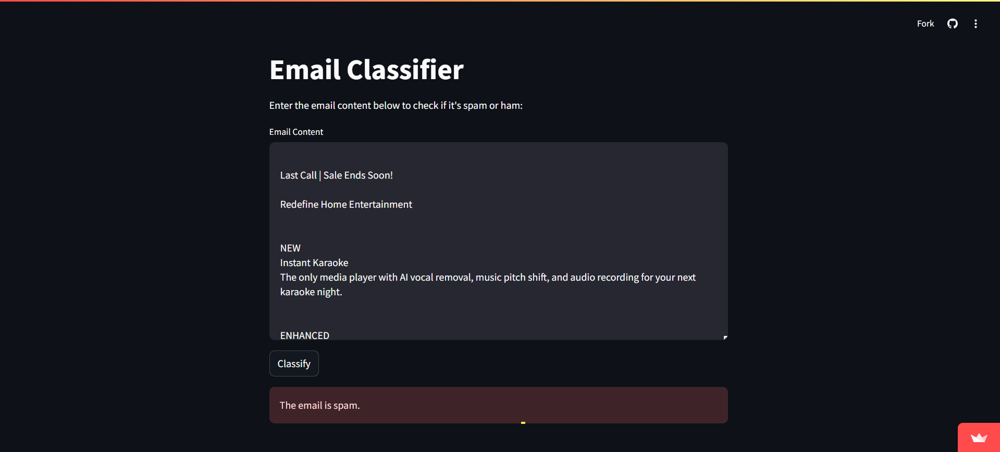
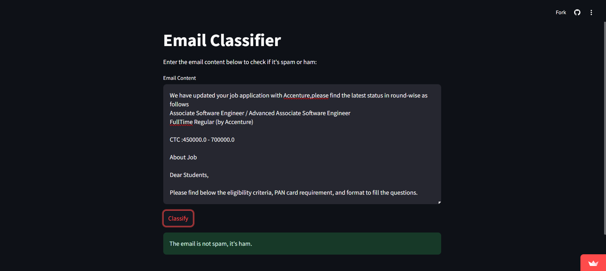

# Email Spam Classifier

This project is an Email Spam Classifier built using various machine learning algorithms. The classifier identifies whether an email is spam or not by analyzing the content. The project is deployed using Streamlit for an interactive user experience.

### Example Screenshots

#### When the Model Predicts Spam:


#### When the Model Predicts Not Spam:


## Live Deployment

Try out the live app here: [Email Spam Classifier](https://emailscapp-lhodbythvnlimawegpmu8m.streamlit.app/)

## Features

- **Data Preprocessing**: The data is cleaned and preprocessed using NLP techniques such as tokenization, stemming, and removal of stopwords and punctuation.
- **Model Training**: Multiple classifiers are trained and evaluated, including Support Vector Machine (SVC) and Extra Trees Classifier (ETC).
- **Interactive Interface**: A Streamlit app allows users to input email text and receive real-time predictions on whether the email is spam or not.

## Technologies Used

- **Python Libraries**: Pandas, Numpy, Matplotlib, Seaborn, NLTK, Scikit-learn, WordCloud
- **Machine Learning Models**: Logistic Regression, SVC, Random Forest, Extra Trees, Gradient Boosting, etc.
- **Deployment**: Streamlit

## Data

The dataset used for training the classifier consists of emails from multiple sources, including Enron, Ling-Spam, and SpamAssassin datasets. The data was combined, cleaned, and processed to create a unified dataset.

## Setup Instructions

1. Clone the repository:

    ```bash
    git clone https://github.com/Eswar021/EmailSC_streamlit.git
    ```

2. Install required dependencies:

    ```bash
    pip install -r requirements.txt
    ```

3. Run the Streamlit app:

    ```bash
    streamlit run app.py
    ```

## Model Overview

Various classifiers were trained and evaluated on their performance metrics such as accuracy and precision. The models considered include:

- **Support Vector Machine (SVC)**
- **Extra Trees Classifier (ETC)**
- **Random Forest Classifier**
- **Gradient Boosting Classifier**

Based on the evaluation, the Extra Trees Classifier (ETC) was selected for deployment due to its superior balance of accuracy and precision.

## How It Works

1. Enter the email content in the text box provided in the Streamlit app.
2. Click the "Classify" button to see if the email is classified as spam or not.


## Future Improvements

- Incorporating additional machine learning models for better accuracy.
- Enhancing data preprocessing with more advanced NLP techniques.
- Expanding the dataset with more diverse email sources.


## Contact

For any questions, please contact pp2549@srmist.edu.in.
